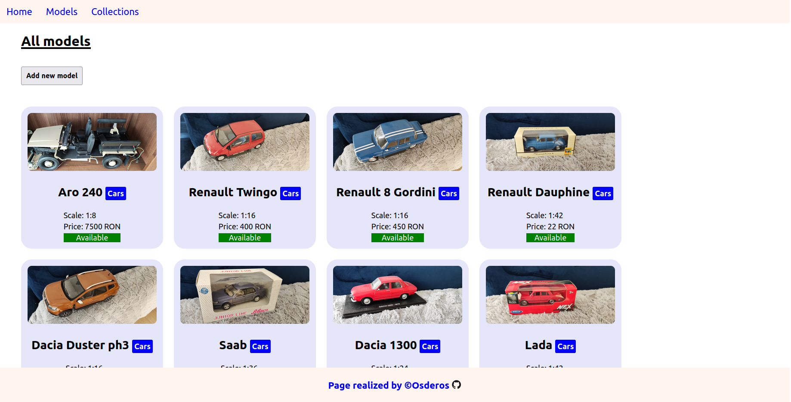

# Personal Model Collection Manager - CRUD app

Preview -> [Check it out](https://sheltered-inlet-50546.herokuapp.com/catalog)

## Summary :

An invetory app to help me manage my collection of models. It consists of a home page where the user can view current models and categories numbers.
After that there are 2 tabs for models and categories. Each contains a list of all items with links to item detail, create , delete , edit item.
An populatedb script has been made to facilitate the upload of files in the db.
Responsive design with minimalist styling.

## Technologies used:

### Backend:
- Node with Express
- JS
- MongoDB with Mongoose

### Frontend:
- HTML
- CSS
- EJS

